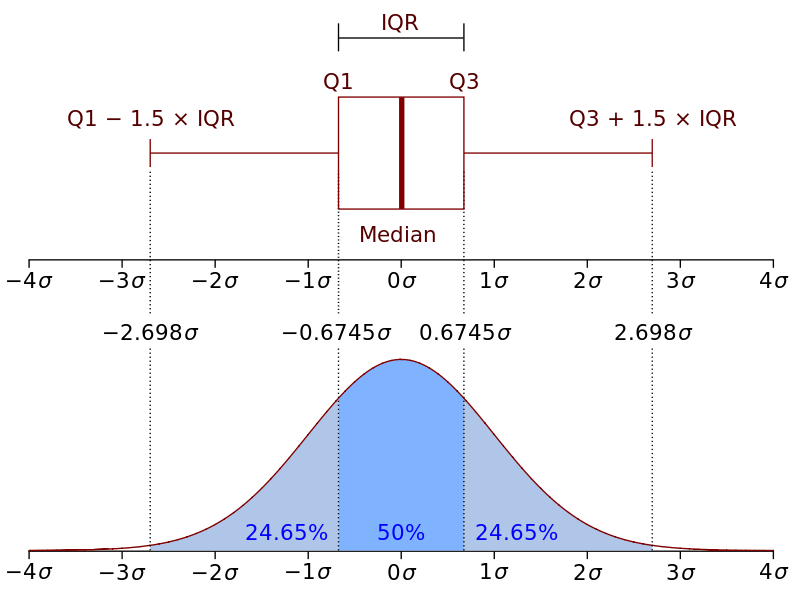

```{r setup, include=FALSE}
library(citr)
library(tidyverse)
library(stringi)
library(ggthemes)
library(kableExtra)
library(knitr)
options("kableExtra.html.bsTable" = T)
knitr::opts_chunk$set(echo = TRUE,
                      comment=NA, 
                      warning = FALSE,
                      message =FALSE)

theme_set(
  theme_gray(base_size = 17) +
  theme(plot.background = element_rect(fill = "transparent", colour = NA)))

```


<style>

slides > slide.backdrop {
  background: white;
}
</style>


# opening


## house-keeping

- unmute your mic to say hello (then mute mic)
- 4hrs with breaks
- there will be exercises
- basics assumed but do ask
- R and RStudio needs to be installed: [install R and RStudio](https://www.earthdatascience.org/courses/earth-analytics/document-your-science/setup-r-rstudio/)
- tidyverse (loads ggplot2)


## workshop folder

- go to github: <https://github.com/jensroes/visualisation-workshop>
- download repository: **visualisation-workshop**
- unpack folder (if downloaded as zip)
- contents:
  - data
  - exercises
  - scripts
  - slides
  - visualisation-workshop.Rproj
- double-click on **visualisation-workshop.Rproj**


## outline

- principles of data visualisation
- grammar of graphics
- aesthetics and attributes
- geometries
- major tools of data visualisation
- cosmetics
- closing remarks
- references


## what is data visualisation?

- graphical representation of data
- graphical data analysis (stats): what do we want to know?
- communication and perception (design): what do we want to communicate?
- exploratory plots: confirm and analyse data (small specialist audience)
- explanatory plots: inform and persuade (wide audience)
- advice: think about the audience


## exploring data

- prices of horses: [Stat2Data library](https://vincentarelbundock.github.io/Rdatasets/doc/Stat2Data/HorsePrices.html)


```{r horses}
horses <- read_csv("../data/horses.csv")
glimpse(horses)
```

## relationship between age and price

```{r, out.width="65%"}
ggplot(data = horses, aes(x = Age, y =  Price)) 
```


## relationship between age and price

```{r, out.width="65%"}

ggplot(data = horses, aes(x = Age, y =  Price)) +
  ### <b>
  geom_point()  
  ### </b>

```


## relationship between age and price

```{r, out.width="65%"}

ggplot(data = horses, aes(x = Age, y = Price)) +
  geom_point() +
  ### <b>
  geom_smooth(method = "lm", se= F) 
  ### </b>

```


## relationship between age and price

```{r, out.width="65%"}

ggplot(data = horses, aes(x = Age, y = Price)) +
  geom_point() +
  ### <b>
  geom_smooth(method = "lm", formula = y ~ x + I(x^2), se = F ) 
  ### </b>

```


## relationship between age and price

```{r, out.width="65%"}
ggplot(data = horses, aes(x = Age, y = Price, colour = Sex)) +
  geom_point() +
  geom_smooth(method = "lm", formula = y ~ x + I(x^2), se = F ) 

```


## explanatory plot

```{r, eval = FALSE}
ggplot(data = horses, aes(x = Age, y = Price, colour = Sex)) +
  geom_point() +
  geom_smooth(method = "lm", se = F, formula = y ~ x + I(x^2), fullrange = T ) +
  ggthemes::theme_clean() +
  scale_y_continuous(labels = scales::dollar_format(prefix = "$")) +
  ggthemes::scale_color_colorblind(labels = c("Female", "Male") ) +
  labs(y = "Price (in US Dollar)", 
       x = "Age (in years)") +
  theme(legend.position = "bottom",
        legend.justification = "right",
        axis.title = element_text(hjust = 0))

```

## explanatory plot

```{r, echo = FALSE, results=TRUE, out.width="80%"}
ggplot(data = horses, aes(x = Age, y = Price, colour = Sex)) +
  geom_point() +
  geom_smooth(method = "lm", se = F, formula = y ~ x + I(x^2), fullrange = T ) +
  ggthemes::theme_clean() +
  scale_y_continuous(labels = scales::dollar_format(prefix = "$")) +
  ggthemes::scale_color_colorblind(labels = c("Female", "Male") ) +
  labs(y = "Price (in US Dollar)", 
       x = "Age (in years)") +
  theme(legend.position = "bottom",
        legend.justification = "right",
        axis.title = element_text(hjust = 0))

```


# why data visualisation?

## why data visualisation? | "[data visualization] forces us to notice what we never expected to see." [@tukey1977exploratory]

- communication of findings
- persuasion of audience
- selecting appropriate stats
- exploring structures in the data (e.g. relationship between two variables)
- understanding patterns (beyond descriptives)


## Anscombe's quartet | @anscombe1973graphs and @tufte1989

```{r}
pivot_longer(data = datasets::anscombe, cols = everything(),
             names_to = c(".value", "Set"), names_pattern = "(.)(.)") %>%
  head(5)
```


## Anscombe's quartet


```{r echo = F, results="asis"}
anscombe <- pivot_longer(data = datasets::anscombe, 
             cols = everything(),
             names_to = c(".value", "Set"),
             names_pattern = "(.)(.)") 

ac_tab <- anscombe %>% group_by(Set) %>%
  summarise_all(list(Mean = mean, SD = sd)) %>%
  mutate_if(is.double, round, 2) %>%
  select(Set, starts_with("x"), starts_with("y")) 

ac_tab %>%
  kable("html", align = c("l", "r", "r", "r", "r"), 
        col.names = c("Data set", "Mean", "SD", "Mean", "SD")) %>%
  kable_styling(bootstrap_options = c("striped", "hover", "responsive"), font_size = 20, full_width = T) %>%
  add_header_above(c(" ", "x" = 2, "y" = 2 ))
```


## Anscombe's quartet 

```{r echo = F, out.width="75%"}
ggplot(anscombe, aes(y = y, x = x)) +
  ### <b>
  facet_wrap(~Set, labeller = label_both) +
  ### </b>
  scale_y_continuous(limits = c(0, 15)) +
  scale_x_continuous(limits = c(0, 20)) +
  geom_smooth(method = "lm", se = F, fullrange = T, colour = "red") +
  theme_bw() +
  theme(strip.text = element_text(hjust = 0, face = "bold"))
```


## Anscombe's quartet 

```{r echo = F, out.width="75%"}
ggplot(anscombe, aes(y = y, x = x)) +
  ### <b>
  facet_wrap(~Set, labeller = label_both) +
  ### </b>
  geom_smooth(method = "lm", se = F, fullrange = T, colour = "red", size = .5) +
  geom_point(color = "blue") +
  scale_y_continuous(limits = c(0, 15)) +
  scale_x_continuous(limits = c(0, 20)) +
  theme_bw() +
  theme(strip.text = element_text(hjust = 0, face = "bold"))
```


## the datasaurus dozen | @matejka2017same: [see link](https://www.autodeskresearch.com/publications/samestats)

- start R-Studio by double-clicking on **visualisation-workshop.Rproj**
- open the script **exercises/tdd.R**

```{r}
tdd <- read_csv("../data/tdd.csv")
summary(tdd)
```


# principles of data visualisation

## basic principles

- no "one fits all" method
- some methods are more informative than others
- maximise what we can learn from data

## basic principles 

- going beyond summary statistics
- descriptive summary statistics may conceal / obscure important patterns
- prevent wrong conclusions about data / theory
- visualisation helps us to understand patterns, structures, relationships
- see e.g. Anscombe's Quartet

## basic principles | @hartwig1979exploratory

- *skepticism:* any visualization might obscure or misrepresent data
- *openness:* there might be patterns and structures that we were not expecting


## basic principles | @tufte1983visual

- above all else show the data
- avoid distorting what the data have to say
- present many numbers in a small space
- encourage the eye to compare different pieces of data
- reveal data at several levels of detail, from broad overview to fine structures


## exercise 1

- data set: mammals [@allison1976sleep; @weisberg1985applied]
- average brain (in g) and body weights (in kg) for 62 species of land mammals. 


```{r }
mammals <- read_csv("../data/mammals.csv") %>%
  rename(species = X1)

glimpse(mammals)
```


## exercise 1 | creating (gg)plots in R

- open script **exercises/Exercise 1.R**
- read and follow the instructions in the comments
- fill in the **_____**s
- run your code (not the entire script): **CTRL+Enter**

# grammar of graphics

## grammar of graphics 

- **gg**plot2 builds on the grammar of graphics [@wickham2016ggplot2;@wickham2010layered]
- higher-level plotting system compared to base R functions (e.g. plot(), hist()) 
- complex visualisations can be creased with a minimal amount of code
- integration of statistical information

## grammar of graphics | @wilkinson1999statistics

- graphics are build on an underlying grammar
- system of rules for mapping variables to graphical properties
- i.e. ingredients (1) and the recipe (2)
- principle 1: graphics consist of distinct layers of grammatical elements (data, aesthetics, geometries)
- principle 2: ... are build around aesthetic mappings


## grammatical elements

- **data:** name of the data variable
- **aesthetics:** mapping between data and graphic properties (axes, size, colour) indicated as **aes()**
- **geometries:** visual elements encoding the data indicated as **geom_...()**


---

```{r  out.width="75%"}
ggplot(data = horses, mapping = aes(y = Price, x = Age, colour = Sex))
```

---


```{r  out.width="75%"}
ggplot(data = horses, mapping = aes(y = Price, x = Age, colour = Sex)) +
  ###<b>
  geom_point()
  ###</b>
```

---

```{r  out.width="75%"}
ggplot(data = horses, mapping = aes(y = Price, x = Age, colour = Sex)) +
  ###<b>
  geom_smooth(method = "lm") 
  ###</b>

```

---

```{r  out.width="75%"}
ggplot(data = horses, mapping = aes(y = Price, x = Age, colour = Sex)) +
  geom_point() +
  geom_smooth(method = "lm") 
```


## optional grammatical elements

- **facets:** dividing data into subplots
- **statistics:** summarising representations
- **coordinates:** plotting space
- **theme:** visual properties not related to the data (font, background)


## ggplot2: layers of grammatical elements

<div style="float: left; width: 28%;">
- data
- aesthetics
</div>

<div style="float: right; width: 72%;">

```{r  out.width="75%"}
ggplot(data = horses, aes(y = Price, x = Age))
```
</div>


## ggplot2: layers of grammatical elements

<div style="float: left; width: 28%;">
- data
- aesthetics
- geometries
</div>

<div style="float: right; width: 72%;">

```{r  out.width="75%"}
ggplot(data = horses, aes(y = Price, x = Age)) +
  geom_point(size = .5)
```
</div>


## ggplot2: layers of grammatical elements

<div style="float: left; width: 28%;">
- data
- aesthetics
- geometries
- facets
</div>

<div style="float: right; width: 72%;">

```{r  out.width="75%"}
ggplot(data = horses, aes(y = Price, x = Age)) +
  geom_point(size = .5) +
  facet_grid( ~ Sex)
```
</div>


## ggplot2: layers of grammatical elements

<div style="float: left; width: 28%;">
- data
- aesthetics
- geometries
- facets
- statistics
</div>

<div style="float: right; width: 72%;">

```{r  out.width="75%"}
ggplot(data = horses, aes(y = Price, x = Age)) +
  geom_point(size = .5) +
  facet_grid( ~ Sex) +
  stat_smooth(method = "lm", se = FALSE, fullrange = TRUE) 
```
</div>


## ggplot2: layers of grammatical elements

<div style="float: left; width: 28%;">
- data
- aesthetics
- geometries
- facets
- statistics
- coordinates
</div>

<div style="float: right; width: 72%;">

```{r  out.width="75%"}
ggplot(data = horses, aes(y = Price, x = Age)) +
  geom_point(size = .5) +
  facet_grid( ~ Sex) +
  stat_smooth(method = "lm", se = FALSE, fullrange = TRUE) +
  coord_fixed(ratio = 2/25000)

```
</div>


## ggplot2: layers of grammatical elements

<div style="float: left; width: 28%;">
- data
- aesthetics
- geometries
- facets
- statistics
- coordinates
</div>

<div style="float: right; width: 72%;">

```{r  out.width="75%"}
ggplot(data = horses, aes(y = Price, x = Age)) +
  geom_point(size = .5) +
  facet_grid( ~ Sex) +
  stat_smooth(method = "lm", se = FALSE, fullrange = TRUE) +
  coord_trans(x = "log", y = "reverse")
```

</div>


## ggplot2: layers of grammatical elements

<div style="float: left; width: 28%;">
- data
- aesthetics
- geometries
- facets
- statistics
- coordinates
</div>

<div style="float: right; width: 72%;">

```{r  out.width="75%"}
ggplot(data = horses, aes(y = Price, x = Age)) +
  geom_point(size = .5) +
  facet_grid( ~ Sex) +
  stat_smooth(method = "lm", se = FALSE, fullrange = TRUE) +
  coord_flip()
```

</div>


## ggplot2: layers of grammatical elements

<div style="float: left; width: 28%;">
- data
- aesthetics
- geometries
- facets
- statistics
- coordinates
- theme
</div>

<div style="float: right; width: 72%;">

```{r  out.width="75%"}
ggplot(data = horses, aes(y = Price, x = Age)) +
  geom_point(size = .25) +
  facet_grid( ~ Sex) +
  stat_smooth(method = "lm", se = FALSE, fullrange = TRUE) +
  theme_dark() 
```
</div>


## ggplot2: layers of grammatical elements

<div style="float: left; width: 28%;">
- data
- aesthetics
- geometries
- facets
- statistics
- coordinates
- theme
</div>

<div style="float: right; width: 72%;">

```{r  out.width="65%"}
ggplot(data = horses, aes(y = Price, x = Age)) +
  geom_point(size = .25) +
  facet_grid( ~ Sex) +
  stat_smooth(method = "lm", se = FALSE, fullrange = TRUE) +
  theme(panel.background = element_blank()) 
```
</div>


## exercise 2 | based on @davis1990body and @fox2011

```{r }
weight <- read_csv("../data/weight.csv") 
glimpse(weight)
```

## exercise 2 | grammatical elements in action

- open script **exercises/Exercise 2a.R**
- read and follow the instructions
- fill in the **____**s
- run code (not the entire script): **CTRL+Enter**
- bonus: **exercises/Exercise 2b.R**


## aesthetics and attributes

<div style="float: left; width: 30%;">
- e.g. colour, fill, size, shape, alpha
- attributes take properties
- aesthetics take variables
</div>

<div style="float: right; width: 63%;">

```{r  out.width="97%"}
ggplot(horses, aes(y = Price, x = Age)) +
  geom_point(colour = "red")
```

</div>

## aesthetics and attributes

<div style="float: left; width: 30%;">
- e.g. colour, fill, size, shape, alpha
- attributes take properties
- aesthetics take variables
</div>

<div style="float: right; width: 63%;">

```{r  out.width="97%"}
ggplot(horses, aes(y = Price, x = Age)) +
  geom_point(aes(colour = "red"))
```


## aesthetics and attributes

<div style="float: left; width: 30%;">
- e.g. colour, fill, size, shape, alpha
- attributes take properties
- aesthetics take variables
</div>

<div style="float: right; width: 63%;">

```{r  out.width="97%"}
ggplot(horses, aes(y = Price, x = Age)) +
  geom_point(aes(colour = Sex))
```

</div>


## aesthetics and attributes

<div style="float: left; width: 30%;">
- e.g. colour, fill, size, shape, alpha
- attributes take properties
- aesthetics take variables
</div>

<div style="float: right; width: 63%;">

```{r  out.width="97%"}
ggplot(horses, aes(y = Price, x = Age)) +
  geom_point(aes(colour = Sex)) +
  geom_smooth(method = "lm")
```

## aesthetics and attributes

<div style="float: left; width: 30%;">
- e.g. colour, fill, size, shape, alpha
- attributes take properties
- aesthetics take variables
</div>

<div style="float: right; width: 63%;">

```{r  out.width="97%"}
ggplot(horses, aes(y = Price, x = Age)) +
  geom_point() +
  geom_smooth(aes(colour = Sex), method = "lm")
```

## aesthetics and attributes

<div style="float: left; width: 30%;">
- e.g. colour, fill, size, shape, alpha
- attributes take properties
- aesthetics take variables
</div>

<div style="float: right; width: 63%;">

```{r  out.width="97%"}
ggplot(horses, aes(y = Price, x = Age)) +
  geom_point(aes(colour = Sex)) +
  geom_smooth(aes(colour = Sex), method = "lm")
```


## aesthetics and attributes

<div style="float: left; width: 30%;">
- e.g. colour, fill, size, shape, alpha
- attributes take properties
- aesthetics take variables
</div>

<div style="float: right; width: 63%;">

```{r  out.width="97%"}
ggplot(horses, aes(y = Price, x = Age, colour = Sex)) +
  geom_point() +
  geom_smooth(method = "lm")
```


## aesthetics and attributes 

```{r out.width="65%"}
ggplot(horses, aes(y = Price, x = Age, colour = Sex)) +
  geom_point(size = 2) 
```


## aesthetics and attributes 


```{r out.width="65%"}
ggplot(horses, aes(y = Price, x = Age, shape = Sex)) +
  geom_point(size = 2)
```


## aesthetics and attributes 

```{r out.width="65%"}
ggplot(horses, aes(y = Price, x = Age, colour = Sex, shape = Sex)) +
  geom_point(size = 2)
```


## aesthetics | typically x, y, colour, fill, size, alpha, linetype, labels

- some are required by geometries; others are optional
- continuous vs discrete variables:
    - e.g. shape and label can only be used for categorical values
- use to facilitate comprehension

---

```{r echo = F}
env <- asNamespace("ggplot2")
all_Geoms <- ls(envir = env, pattern = "^Geom.+")
all_Geoms <- mget(all_Geoms, env)
all_aes <- map(all_Geoms, ~.$aesthetics())

# change Geom* to geom_*
names(all_aes) <- 
  names(all_aes) %>%
  substr(5,nchar(.)) %>% 
  tolower() %>% 
  paste0("geom_",.)

# remove if geom_* doesn't exist
all_aes[!names(all_aes) %in% ls(envir = env)] <- NULL

```

- scatterplot: geom_point()
```{r echo = FALSE, results=TRUE}
cat(paste(all_aes$geom_point, collapse = ", "))
```

- barplot: geom_bar()
```{r echo = FALSE, results=TRUE}
cat(paste(all_aes$geom_bar, collapse = ", "))
```

- boxplot: geom_boxplot()
```{r echo = FALSE, results=TRUE}
x <- paste(all_aes$geom_boxplot, collapse = ", ")
stri_sub(x, 78, 76) <- "\n"
cat(x)
```


## decoding of continuous variables 

<div style="float: left; width: 65%;">

![[@wong2010points, 665]](gfx/wong2010.png){#id .class width=80% height=75%}

</div>

<div style="float: right; width: 35%;">
- position on a common scale
- position on the same but nonaligned scales
- lengths
- angles, slopes
- areas
- volume, monochromatic colour spectrum (saturation, grey scale)
- pure spectrum colours
</div>


## decoding of continuous variables | position on common scale

```{r  out.width="50%"}
ggplot(data = horses, aes(x = Age, y = Price)) +
  geom_point(size = 3) +
  facet_grid(~Sex)
```

## decoding of continuous variables | position on non aligned scale


```{r  out.width="50%"}
ggplot(data = horses, aes(x = Age, y = Price)) +
  geom_point(size = 3) +
  facet_wrap(~Sex, scales = "free_y")
```


## decoding of continuous variables | colour spectrum


```{r  out.width="50%"}
ggplot(data = horses, aes(x = Age, y = Sex, colour = Price)) +
  geom_point(size = 3) 
```


## decoding of continuous variables | area (size)


```{r  out.width="50%"} 
ggplot(data = horses, aes(x = Age, y = Sex, size = Price)) +
  geom_point() 

```


## decoding of categorical variables (groups)


<div style="float: left; width: 60%;">

```{r  out.width="100%"}
ggplot(data = horses, aes(x = Age, y = Price, 
                          colour = Sex)) +
  geom_point(size = 3) 
```

</div>


<div style="float: right; width: 40%;">
- qualitative colours, labels, line colours
- sequential colours, shape outlines, line type
- filled shapes, hatching (shading with lines), line width
</div>


## decoding of categorical variables (groups)


<div style="float: left; width: 60%;">

```{r  out.width="100%"}
ggplot(data = horses, aes(x = Age, y = Price, 
                          label = Sex)) +
  geom_text(size = 3)
```

</div>


<div style="float: right; width: 40%;">
- qualitative colours, labels, line colours
- sequential colours, shape outlines, line type
- filled shapes, hatching (shading with lines), line width
</div>


## decoding of categorical variables (groups)


<div style="float: left; width: 60%;">

```{r  out.width="100%"}
ggplot(data = horses, aes(x = Age, y = Price,
                          shape = Sex)) +
  geom_point(size = 3)
```

</div>


<div style="float: right; width: 40%;">
- qualitative colours, labels, line colours
- sequential colours, shape outlines, line type
- filled shapes, hatching (shading with lines), line width
</div>


## decoding of categorical variables (groups)

<div style="float: left; width: 60%;">

```{r  out.width="100%"}
ggplot(data = horses, aes(x = Age, y = Price, 
                          colour = Sex)) +
  geom_smooth(method = "lm", se = F)
```

</div>


<div style="float: right; width: 40%;">
- qualitative colours, labels, line colours
- sequential colours, shape outlines, line type
- filled shapes, hatching (shading with lines), line width
</div>


## decoding of categorical variables (groups)

<div style="float: left; width: 60%;">

```{r  out.width="100%"}
ggplot(data = horses, aes(x = Age, y = Price, 
                          linetype = Sex)) +
  geom_smooth(method = "lm", se = F)
```

</div>


<div style="float: right; width: 40%;">
- qualitative colours, labels, line colours
- sequential colours, shape outlines, line type
- filled shapes, hatching (shading with lines), line width
</div>


## decoding of categorical variables (groups)

<div style="float: left; width: 60%;">

```{r  out.width="100%"}
ggplot(data = horses, aes(x = Age, y = Price, 
                          size = Sex)) +
  geom_smooth(method = "lm", se = F)
```

</div>


<div style="float: right; width: 40%;">
- qualitative colours, labels, line colours
- sequential colours, shape outlines, line type
- filled shapes, hatching (shading with lines), line width
</div>


## exercise 3 | practice aesthetics and attributes

- open script **exercises/Exercise 3a.R**
- read and follow the instructions
- fill in the **_____**s
- continue with **exercises/Exercise 3b.R**
- and **exercises/Exercise 3c.R**


# major visualisation tools 

## major visualisation tools

- visual encoding of aesthetics layer
- ~50 geometries: geom_...

```{r echo = F}
env <- asNamespace("ggplot2")
all_geoms <- ls(envir = env, pattern = "^geom_+")

geoms <- tolower(gsub("geom_", "", all_geoms))
#which(!(geoms %in% c("annotationmap", "col", "sf", "spoke")))

print(geoms)
```


## major visualisation tools 

- other packages such as tidybayes and ggridges
- many can be combined
- depends on visualisation goal
- and your subject domain
- three important groups: 
  - bivariate distributions 
  - univariate distributions
  - group comparisons

## major visualisation tools | bivariate distribution

- function: relationship between two variables
- variable type: typically continuous
- examples: scatter plot, time series

## major visualisation tools | scatter plot

```{r  out.width="65%", echo = FALSE, results=FALSE}
ggplot(data = horses, aes(x = Age, y = Price)) +
  geom_point() +
  labs(y = "Horse price") 
```


## major visualisation tools | scatter plot

```{r  out.width="65%", echo = FALSE, results=FALSE}
ggplot(data = horses, aes(x = Age, y = Price)) +
  geom_point() +
  geom_smooth(method = "lm") +
  labs(y = "Horse price")
```


```{r echo = FALSE, results=FALSE}
# Get up-to-date COVID-19 data
source("../scripts/get_covid_data.R")
covid3 <- covid %>% filter(Country %in% c("Albania", "Croatia", "Bulgaria"))
```

## major visualisation tools | time series

```{r out.width="65%", echo = FALSE, results =TRUE}
ggplot(data = covid3, aes(x = Date, y = Deaths, group = Country, colour = Country, fill = Country)) +
  geom_point() +
  labs(y = "Total of COVID-19 deaths")
```


## major visualisation tools | time series

```{r out.width="65%", echo = FALSE, results =TRUE}
ggplot(data = covid3, aes(x = Date, y = Deaths, group = Country, colour = Country, fill = Country)) +
  geom_line() +
  labs(y = "Total of COVID-19 deaths")
```


## major visualisation tools | univariate distribution

<div style="float: left; width: 40%;">

- function: distribution of values
- variable type: continuous or discrete
- examples: histograms, density plots, bar plots

</div>

<div style="float: right; width: 50%;">

```{r  out.width="100%"}
ggplot(data = horses, aes(x = Sex)) +
  geom_bar()
```

</div>


## major visualisation tools | univariate distribution

<div style="float: left; width: 40%;">

- function: distribution of values
- variable type: continuous or discrete
- examples: histograms, density plots, bar plots

</div>

<div style="float: right; width: 50%;">

```{r  out.width="100%"}
ggplot(data = horses, aes(x = Price)) +
  geom_histogram()
```

</div>

## major visualisation tools | univariate distribution

<div style="float: left; width: 40%;">

- function: distribution of values
- variable type: continuous or discrete
- examples: histograms, density plots, bar plots

</div>

<div style="float: right; width: 50%;">

```{r  out.width="100%"}
ggplot(data = horses, aes(x = Price)) +
  geom_density()
```

</div>


## major visualisation tools | group comparisons

- function: distribution of values for two or more groups (often closely tied to statistical descriptions)
- variable type: continuous 
- examples: points / jitter, box plot, violin plot, barplot (pie chart), dynamite plots


## major visualisation tools | dynamite plot and pitfalls thereof


<div style="float: left; width: 40%;">

- suggest normal distribution?
- same number of observations in each group?
- bars suggest data where there are none?
- are there no values above the errorbar?

</div>

<div style="float: right; width: 55%;">


```{r  out.width="100%", echo = FALSE, results=FALSE}
ggplot(data = horses, aes(y = Price, x = Sex)) +
  stat_summary(fun.y = mean, geom = "bar") +
  stat_summary(fun.data = mean_sdl, 
               fun.args = list(mult = 1), 
               geom = "errorbar", width = .45) +
  ylim(c(0,65e3))
```

</div>


## major visualisation tools | dynamite plots

```{r  out.width="65%", echo = FALSE, results=FALSE}
ggplot(data = horses, aes(y = Price, x = Sex)) +
  stat_summary(fun.y = mean, geom = "bar") +
  stat_summary(fun.data = mean_sdl, 
               fun.args = list(mult = 1), 
               geom = "errorbar", width = .45) +
  ylim(c(0,65e3))
```

## major visualisation tools | points


```{r  out.width="65%", echo = FALSE, results=FALSE}
ggplot(data = horses, aes(y = Price, x = Sex)) +
  geom_point(size = 1) +
  ylim(c(0,65e3))
```


## major visualisation tools | jittered points


```{r  out.width="65%", echo = FALSE, results=FALSE}
ggplot(data = horses, aes(y = Price, x = Sex)) +
  geom_jitter(width = .1, size = 1) +
  ylim(c(0,65e3))
```


## major visualisation tools | jittered points and errorbars


```{r  out.width="65%", echo = FALSE, results=FALSE}
ggplot(data = horses, aes(y = Price, x = Sex)) +
  geom_jitter(width = 0.1, size = 1) + 
  stat_summary(fun.y = mean, 
               geom = "point",
               col = "darkred",
               size = 3) +
  stat_summary(fun.data = mean_sdl, 
               fun.args = list(mult = 1), 
               geom = "errorbar", 
               col = "darkred",
               width = .25) +
  ylim(c(0,65e3))
```


## major visualisation tools | box-and-whiskers plot


```{r  out.width="65%", echo = FALSE, results=FALSE}
ggplot(data = horses, aes(y = Price, x = Sex)) +
  geom_boxplot(width = .25) +
  ylim(c(0,65e3))
```

## major visualisation tools | box-and-whiskers plot


```{r  out.width="65%", echo = FALSE, results=FALSE}
ggplot(data = horses, aes(y = Price, x = Sex)) +
  geom_boxplot(width = .25, outlier.shape = NA) +
  geom_jitter(width = .1, alpha = .25) +
  ylim(c(0,65e3))
```


## major visualisation tools | box-and-whiskers plot [@tukey1977exploratory]

<div style="float: right;">

{#id .class width=70%}

</div>

## exercise 4 | major visualisation tools

- open script **exercises/Exercise 4a.R**
- read and follow the instructions
- fill in the **_____**s
- continue with **exercises/Exercise 4b.R**


# cosmetics 

## changing text: labs

<div style="float: left; width: 40%;">
- title
- subtitle
- caption
- tag
- x
- y
- colour, shape etc
</div>

<div style="float: left; width: 60%;">

```{r  out.width="80%"}
ggplot(data = horses, aes(y = Price, x = Age,
                          colour = Sex)) +
  geom_point() + 
  ###<b>
  labs()
  ###</b>
```

</div>


## changing text: labs

<div style="float: left; width: 40%;">
- title
- subtitle
- caption
- tag
- x
- y
- colour, shape etc
</div>

<div style="float: left; width: 60%;">

```{r  out.width="90%"}
ggplot(data = horses, aes(y = Price, x = Age,
                          colour = Sex)) +
  geom_point() + 
  ###<b>
  labs(title = "My scatter plot")
  ###</b>
```

</div>

## changing text: labs

<div style="float: left; width: 40%;">
- title
- subtitle
- caption
- tag
- x
- y
- colour, shape etc
</div>

<div style="float: left; width: 60%;">

```{r  out.width="90%"}
ggplot(data = horses, aes(y = Price, x = Age,
                          colour = Sex)) +
  geom_point() + 
  ###<b>
  labs(title = "My scatter plot", 
       subtitle = "I'm a subtitle")
  ###</b>
```

</div>

## changing text: labs

<div style="float: left; width: 40%;">
- title
- subtitle
- caption
- tag
- x
- y
- colour, shape etc
</div>

<div style="float: left; width: 60%;">

```{r  out.width="90%"}
ggplot(data = horses, aes(y = Price, x = Age,
                          colour = Sex)) +
  geom_point() + 
  ###<b>
  labs(caption = "Caption for data source")
  ###</b>
```

</div>


## changing text: labs

<div style="float: left; width: 40%;">
- title
- subtitle
- caption
- tag
- x
- y
- colour, shape etc
</div>

<div style="float: left; width: 60%;">

```{r  out.width="90%"}
ggplot(data = horses, aes(y = Price, x = Age,
                          colour = Sex)) +
  geom_point() + 
  ###<b>
  labs(tag = "A")
  ###</b>
```

</div>

## changing text: labs

<div style="float: left; width: 40%;">
- title
- subtitle
- caption
- tag
- x
- y
- colour, shape etc
</div>

<div style="float: left; width: 60%;">

```{r  out.width="90%"}
ggplot(data = horses, aes(y = Price, x = Age,
                          colour = Sex)) +
  geom_point() + 
  ###<b>
  labs(x = "Age of horse", 
       y = "Price of horse in $")
  ###</b>
```

</div>

## changing text: labs

<div style="float: left; width: 40%;">
- title
- subtitle
- caption
- tag
- x
- y
- colour, shape etc
</div>

<div style="float: left; width: 60%;">

```{r  out.width="90%"}
ggplot(data = horses, aes(y = Price, x = Age,
                          colour = Sex)) +
  geom_point() + 
  ###<b>
  labs(colour = "Legend\ntitle:")
  ###</b>
```

</div>


## changing text: legend keys

<div style="float: left; width: 40%;">
- scale_colour_discrete
- scale_colour_continuous
- scale_colour_manual
- or any other aesthetic instead of colour
</div>

<div style="float: left; width: 60%;">

```{r  out.width="90%"}
ggplot(data = horses, aes(y = Price, x = Age,
                          colour = Sex)) +
  geom_point() +  
  ###<b>
  scale_colour_discrete(labels = c("female", "male")) 
  ###</b>
```

</div>


## changing text: legend keys

<div style="float: left; width: 40%;">
- change colour values manually
- colour names: [link](http://sape.inf.usi.ch/quick-reference/ggplot2/colour)
</div>

<div style="float: left; width: 60%;">

```{r  out.width="90%"}
ggplot(data = horses, aes(y = Price, x = Age,
                          colour = Sex)) +
  geom_point() +  
  ###<b>
  scale_colour_manual(labels = c("female", "male"),
        values = c("darkseagreen", "firebrick"))
  ###</b>
```

</div>


## changing text: legend keys

<div style="float: left; width: 40%;">
- change colour values manually
- colour names: [link](http://sape.inf.usi.ch/quick-reference/ggplot2/colour)
</div>

<div style="float: left; width: 60%;">

```{r  out.width="90%"}
ggplot(data = horses, aes(y = Price, x = Age,
                          colour = Sex)) +
  geom_point() +  
  ###<b>
  scale_colour_manual(labels = c("female", "male"),
        values = c("darkseagreen3", "firebrick1"))
  ###</b>
```

</div>


## changing text: legend keys

<div style="float: left; width: 40%;">
- change colour values manually
- colour names: [link](http://sape.inf.usi.ch/quick-reference/ggplot2/colour)
</div>

<div style="float: left; width: 60%;">

```{r }
  mycolours = c("#000000", "#E69F00", "#56B4E9",
                "#009E73", "#F0E442", "#0072B2", 
                "#D55E00", "#CC79A7")
```

</div>


## changing text: legend keys

<div style="float: left; width: 40%;">
- change colour values manually
- colour names: [link](http://sape.inf.usi.ch/quick-reference/ggplot2/colour)

</div>

<div style="float: left; width: 60%;">

```{r  out.width="90%"}
ggplot(data = horses, aes(y = Price, x = Age,
                          colour = Sex)) +
  geom_point() +  
  ###<b>
  scale_colour_manual(labels = c("female", "male"),
                      values = mycolours[c(1,2)])
  ###</b>
```

</div>


## changing text: legend keys

<div style="float: left; width: 40%;">
- change colour values manually
- colour names: [link](http://sape.inf.usi.ch/quick-reference/ggplot2/colour)
- ggthemes
</div>

<div style="float: left; width: 60%;">

```{r  out.width="90%"}
ggplot(data = horses, aes(y = Price, x = Age,
                          colour = Sex)) +
  geom_point() +  
  ###<b>
  scale_colour_colorblind(labels = c("female", "male"))
  ###</b>
```

</div>


## changing text: strips 


```{r  out.width="65%"}
ggplot(data = horses, aes(y = Price, x = Age)) +
  geom_point() + 
  ###<b>
  facet_grid(~Sex)
  ###</b>
```


## changing text: strips 

```{r echo=FALSE}
p <- ggplot(data = horses, aes(y = Price, x = Age)) +
  geom_point() + 
  facet_grid(~Sex)
```

```{r}
###<b>
horses$Sex <- recode(horses$Sex, f = "female", m = "male")
###</b>
```

```{r echo=FALSE, out.width="65%"}
p
```


## changing text: strips 

```{r out.width="65%"}
ggplot(data = horses, aes(y = Price, x = Age)) +
  geom_point() + 
  facet_grid(~Sex)
```


## changing text: strips 


```{r  out.width="65%"}
ggplot(data = horses, aes(y = Price, x = Age)) +
  geom_point() + 
  ###<b>
  facet_grid(~Sex, labeller = label_both)
  ###</b>
```


## themes

- specify appearance of non-data related ink

```{r echo = F}
env <- asNamespace("ggplot2")
all_themes <- ls(envir = env, pattern = "^theme_+")
all_themes <- all_themes[!str_detect(all_themes, "all|get|replace|set|test|update|gray")]
print(all_themes)
```

- e.g. ggthemes for more
- set default: theme_set(theme_minimal())
- adjust base font: e.g. base_size = 14

## themes

```{r  out.width="55%"}
ggplot(data = horses, aes(y = Price, x = Age)) +
  geom_point() + facet_grid(~Sex) +
  ###<b>
  theme_grey(base_size = 14)
  ###</b>
```

## themes

```{r  out.width="55%"}
ggplot(data = horses, aes(y = Price, x = Age)) +
  geom_point() + facet_grid(~Sex) +
  ###<b>
  theme_minimal(base_size = 14)
  ###</b>
```

## themes

```{r  out.width="55%"}
ggplot(data = horses, aes(y = Price, x = Age)) +
  geom_point() + facet_grid(~Sex) +
  ###<b>
  theme_light(base_size = 14)
  ###</b>
```

## themes

<div style="float: left; width: 40%;">

- axis
- legend
- panel
- plot
- strip

</div>

<div style="float: right; width: 60%;">

```{r  out.width="80%"}
ggplot(data = horses, aes(y = Price, x = Age)) +
  geom_point() + 
  ###<b>
  theme()
  ###</b>
```

</div>

## themes: axis

<div style="float: left; width: 40%;">

- axis.text
  - axis.text.x
  - axis.text.y
- axis.title
  - axis.title.x
  - axis.title.y

</div>

<div style="float: right; width: 60%;">

```{r  out.width="80%"}
ggplot(data = horses, aes(y = Price, x = Age)) +
  geom_point() + 
  ###<b>
  theme(axis.text = element_text(face = "bold"))
  ###</b>
```

</div>


## themes: axis

<div style="float: left; width: 40%;">

- axis.text
  - axis.text.x
  - axis.text.y
- axis.title
  - axis.title.x
  - axis.title.y

</div>

<div style="float: right; width: 60%;">

```{r  out.width="80%"}
ggplot(data = horses, aes(y = Price, x = Age)) +
  geom_point() + 
  ###<b>
  theme(axis.title = element_text(face = "bold"))
  ###</b>
```

</div>


## themes: axis

<div style="float: left; width: 40%;">

- axis.text
  - axis.text.x
  - axis.text.y
- axis.title
  - axis.title.x
  - axis.title.y

</div>

<div style="float: right; width: 60%;">

```{r  out.width="80%"}
ggplot(data = horses, aes(y = Price, x = Age)) +
  geom_point() + 
  ###<b>
  theme(axis.title.y = element_text(face = "bold"))
  ###</b>
```

</div>


## themes: legend

<div style="float: left; width: 40%;">
 - legend.background
 - legend.margin
 - legend.spacing
 - legend.key
 - legend.text
 - legend.title
 - legend.position
 - legend.orientation
 - legend.justification
 - legend.box
</div>

<div style="float: right; width: 60%;">

```{r  out.width="80%"}
ggplot(data = horses, aes(y = Price, x = Age, 
                          colour = Sex)) +
  geom_point() + 
  ###<b>
  theme()
  ###</b>
```

</div>


## themes: legend

<div style="float: left; width: 40%;">
 - legend.background
 - legend.margin
 - legend.spacing
 - legend.key
 - legend.text
 - legend.title
 - legend.position
 - legend.orientation
 - legend.justification
 - legend.box

</div>

<div style="float: right; width: 60%;">

```{r  out.width="80%"}
ggplot(data = horses, aes(y = Price, x = Age, 
                          colour = Sex)) +
  geom_point() + 
  ###<b>
  theme(legend.position = "top")
  ###</b>
```

</div>

## themes: legend

<div style="float: left; width: 40%;">

 - legend.background
 - legend.margin
 - legend.spacing
 - legend.key
 - legend.text
 - legend.title
 - legend.position
 - legend.orientation
 - legend.justification
 - legend.box
</div>

<div style="float: right; width: 60%;">

```{r  out.width="80%"}
ggplot(data = horses, aes(y = Price, x = Age, 
                          colour = Sex)) +
  geom_point() + 
  ###<b>
  theme(legend.position = "top", 
        legend.justification = "right")
  ###</b>
```

</div>

## themes: legend

<div style="float: left; width: 40%;">

 - legend.background
 - legend.margin
 - legend.spacing
 - legend.key
 - legend.text
 - legend.title
 - legend.position
 - legend.orientation
 - legend.justification
 - legend.box

</div>

<div style="float: right; width: 60%;">

```{r  out.width="80%"}
ggplot(data = horses, aes(y = Price, x = Age, 
                          colour = Sex)) +
  geom_point() + 
  ###<b>
  theme(legend.position = c(.9,.8))
  ###</b>
```

</div>


## themes: panel

<div style="float: left; width: 40%;">

- panel.background
- panel.border
- panel.spacing
- panel.grid
  - panel.grid.major
  - panel.grid.minor

</div>

<div style="float: right; width: 60%;">

```{r  out.width="80%"}
ggplot(data = horses, aes(y = Price, x = Age)) +
  geom_point() + 
  ###<b>
  theme()
  ###</b>
```

</div>

## themes: panel

<div style="float: left; width: 40%;">

- panel.background
- panel.border
- panel.spacing
- panel.grid
  - panel.grid.major
  - panel.grid.minor

</div>

<div style="float: right; width: 60%;">

```{r  out.width="80%"}
ggplot(data = horses, aes(y = Price, x = Age)) +
  geom_point() + 
  ###<b>
  theme(panel.background = element_blank())
  ###</b>
```

</div>


## themes: plot


<div style="float: left; width: 40%;">
- plot.background
- plot.title
- plot.subtitle
- plot.caption
- plot.tag
- plot.margin
</div>


<div style="float: left; width: 60%;">

```{r  out.width="80%"}
ggplot(data = horses, aes(y = Price, x = Age)) +
  geom_point() +
  ###<b>
  theme()
  ###</b>
```

</div>


## themes: plot

<div style="float: left; width: 40%;">
- plot.background
- plot.title
- plot.subtitle
- plot.caption
- plot.tag
- plot.margin
</div>


<div style="float: left; width: 60%;">

```{r  out.width="80%"}
ggplot(data = horses, aes(y = Price, x = Age)) +
  geom_point() + 
  ###<b>
  theme(plot.background = element_rect(fill = "pink"))
  ###</b>
```


## themes: plot

<div style="float: left; width: 40%;">
- plot.background
- plot.title
- plot.subtitle
- plot.caption
- plot.tag
- plot.margin
</div>


<div style="float: left; width: 60%;">

```{r  out.width="80%"}
ggplot(data = horses, aes(y = Price, x = Age)) +
  geom_point() + 
  labs(title = "I'm a title") +
  ###<b>
  theme(plot.title = element_text(colour = "pink"))
  ###</b>
```


## themes: plot

<div style="float: left; width: 40%;">
- plot.background
- plot.title
- plot.subtitle
- plot.caption
- plot.tag
- plot.margin
</div>


<div style="float: left; width: 60%;">

```{r  out.width="80%"}
ggplot(data = horses, aes(y = Price, x = Age)) +
  geom_point() + 
  labs(caption = "I'm a caption") +
  ###<b>
  theme(plot.caption = element_text(face = "italic"))
  ###</b>
```


## themes: plot

<div style="float: left; width: 40%;">
- plot.background
- plot.title
- plot.subtitle
- plot.caption
- plot.tag
- plot.margin
</div>


<div style="float: left; width: 60%;">

```{r  out.width="80%"}
ggplot(data = horses, aes(y = Price, x = Age)) +
  geom_point() + 
  ###<b>
  theme(plot.margin = unit(c(2,2,2,2), "cm"))
  ###</b>
```

</div>


## themes: facet strips

<div style="float: left; width: 40%;">
- strip.background
- strip.placement
- strip.text
</div>


<div style="float: right; width: 60%;">

```{r  out.width="80%"}
ggplot(data = horses, aes(y = Price, x = Age)) +
  geom_point() + 
  facet_grid(~Sex, labeller = label_both) +
  ###<b>
  theme()
  ###</b>
```

</div>


## themes: strip.background


```{r  out.width="55%"}
ggplot(data = horses, aes(y = Price, x = Age)) +
  geom_point() + 
  facet_grid(~Sex, labeller = label_both) +
  ###<b>
  theme(strip.background = element_blank())
  ###</b>
```

</div>

## themes: strip.background


```{r  out.width="55%"}
ggplot(data = horses, aes(y = Price, x = Age)) +
  geom_point() + 
  facet_grid(~Sex, labeller = label_both) +
  ###<b>
  theme(strip.background = element_rect(fill = "forestgreen"))
  ###</b>
```

## themes: strip.text


```{r  out.width="55%"}
ggplot(data = horses, aes(y = Price, x = Age)) +
  geom_point() + 
  facet_grid(~Sex, labeller = label_both) +
  ###<b>
  theme(strip.background = element_rect(fill = "forestgreen"),
        strip.text = element_text(colour = "white", hjust = 0))
  ###</b>
```

## themes: strip.text


```{r  out.width="45%"}
ggplot(data = horses, aes(y = Price, x = Age)) +
  geom_point() + 
  facet_grid(~Sex, labeller = label_both) +
  ###<b>
  theme(strip.background = element_rect(fill = "forestgreen"),
        strip.text = element_text(colour = "white", hjust = 0, 
                                  face = "bold", size = 16, angle = 180))
  ###</b>
```


## saving your plot

- ggsave("name of plot.png", width = 5, height = 5 )
- types: pdf, png, tiff, jpg
- sizes requires some manual adjustment
- keep the aspect ratio sensible
- or export function in **plots** panel


## exercise 5 | bringing everything together

- Up-to-date COVID-19 data
- open script **exercises/Exercise 5a.R**
- read and follow the instructions
- fill in the **_____**s
- continue with **exercises/Exercise 5b.R**


# closing remarks

## useful resources

- R for data science chapter 3: [r4ds.had.co.nz](https://r4ds.had.co.nz/data-visualisation.html)
- choosing the right visualisation: [data-to-viz.com](https://www.data-to-viz.com/)
- Rick Scavetta's course: [datacamp.com](https://learn.datacamp.com/skill-tracks/data-visualization-with-r)
- need a data set for practicing: [vincentarelbundock.github.io](https://vincentarelbundock.github.io/Rdatasets/datasets.html)
- ggplot2 [CheatSheet](https://rstudio.com/wp-content/uploads/2015/03/ggplot2-cheatsheet.pdf)
- most important functions: [ggplot2.tidyverse.org](https://ggplot2.tidyverse.org/reference/)
- example for 3d plots

## references

<style>
slides > slide { overflow: scroll; }
slides > slide:not(.nobackground):after {
  content: '';
}
</style>

